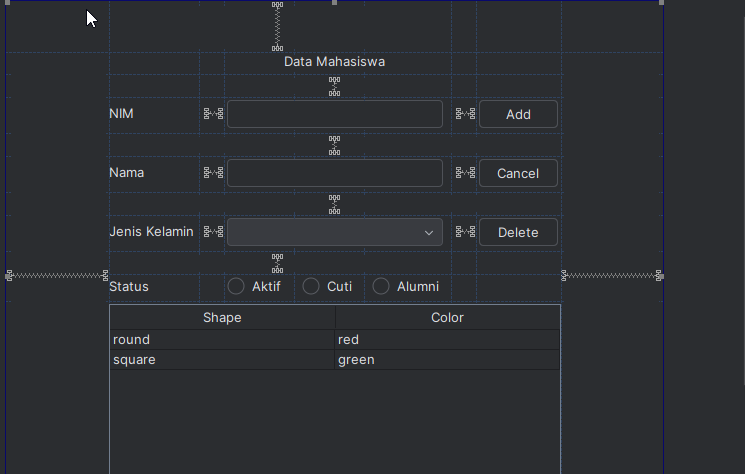

# Tugas Praktikum 4 DPBO 2025
Putra Hadiyanto Nugroho (2308163)

Ilmu Komputer C1 
Universtias Pendidikan Indonesia

# Janji
Saya Putra Hadiyanto Nugroho dengan NIM 2308163 mengerjakan Tugas Praktikum 4 dalam mata kuliah Desain dan Pemrograman Berorientasi Objek untuk keberkahanNya maka saya tidak melakukan kecurangan seperti yang telah dispesifikasikan. Aamiin.

# Desain Program
Program ini merupakan sebuah `CRUD` untuk data mahasiswa berbasis Java menggunakan Swing untuk GUI. Terdapat 2 class pada program, yaitu : 

### 1. Class Mahasiswa
Class ini berisi data mahasiswa. Terdapat atribut bawaan soal `nim`, `nama`, dan `jenisKelamin`. Saya menambahkan satu atribut baru yaitu `statusMahasiswa`. Method yang ada yaitu setter dan getter dari setiap atribut.

### 2. Class Menu extends JFrame
Class ini berisi `Graphical User Interface (GUI)` dari program, berfungsi untuk mengatur GUI, serta method untuk `insert`, `update`, dan `delete`.

### 3. Desain GUI

    

# Alur Program
### 1. Tampilan Utama
Tampilan utama berisi formulir data mahasiswa, tabel data mahasiswa, tombol aksi Add/Update, Delete, dan Cancel.

### 2. Penambahan Data Baru
User dapat menambahkan data baru dengan mengisi form data mahasiswa, kemudian klik tombol aksi `Add` untuk menyimpannya ke dalam list dan tabel.

### 3. Update Data
Apabila user memilih salah satu data mahasiswa di tabel mahasiswa, maka form mahasiswa akan terisi dengan data mahasiswa yang dipilih. Untuk melakukan Update data, user perlu mengganti data di form mahasiswa dan menekan tombol `Update`.

### 4. Delete Data
Sama seperti dengan Update, user dapat memilih salah satu data mahasiswa di tabel mahasiswa. Kemudian, user dapat menekan tombol `Delete` dan lakukan konfirmasi ulang di popup delete, maka data akan dihapus dari list.

# Dokumentasi
https://raw.githubusercontent.com/putrahadiyanto/TP4DPBO2025C1/refs/heads/main/documentation/vidDokumentasi.mp4
